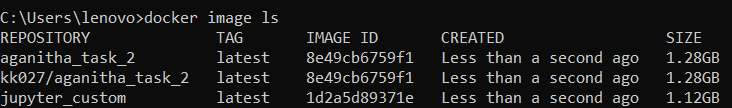

# Terminal Screenshots to Initialize Docker for JupyterLab and Postgres

### 1. Commands to view all the images present in docker desktop

### 2. Commands to remove images from docker desktop

### 3. Pushing a docker image on docker hub

### 4. Run a container of an image created to initiate a docker container of jupyter lab instance which is used to connect to postgres database and a mock (pseudo) database is created 
to give an example of using PostgresSQL

### 5. Running a jupyter lab instance in docker container in port 8888 on local machine.

